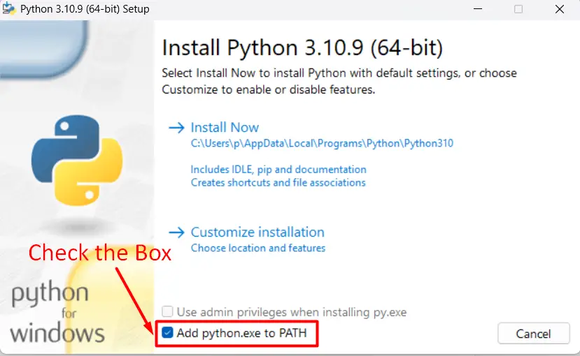

# Introduksjon
Hei! Er du klar for å avsløre hemmeligheter og skjulte beskjeder? Her kan du lære om forskjellige teknikker for å skjule
og finne informasjon, og kanskje det skjuler seg en belønning hvis du klarer å løse alle utfordringene?

God jul!

# Oppsett

Jeg anbefaler å bruke PC. Du trenger disse verktøyene for å komme i gang:

- [git](https://github.com/git-guides/install-git)
- [Python 3.11](https://www.python.org/downloads/release/python-3117/) (Scroll ned og velg en installasjonsfil
  under ``Files`` seksjonen, f.eks. for Windows, velg ``Windows installer (64-bit)``).
  ***NB:*** For Windows, huk av ``Add python.exe to PATH`` (se bilde under)
- [PyCharm (Community Edition)](https://www.jetbrains.com/pycharm/download) (Scroll ned for å laste ned PyCharm
  Community Edition)



PyCharm basics: [https://www.youtube.com/watch?v=HHcZbXsZtm0](https://www.youtube.com/watch?v=HHcZbXsZtm0)

Python basics (optional): [https://www.youtube.com/watch?v=woVJ4N5nl_s](https://www.youtube.com/watch?v=woVJ4N5nl_s)

For å sette i gang, last ned dette git repo'et. Kopier inn i kommandolinjen:

```
git clone https://github.com/bjotho/godJul2023.git
```

Lag et virtuelt python miljø i repo'et (eller åpne PyCharm og følg instruksjoner der):

```
cd path/to/godJul2023
python -m venv venv
```

Installer dependencies:

```
pip install -r requirements.txt
```

Lykke til!

# Bruk

Repoet inneholder diverse filer (Python filer, bildefiler, datafiler, osv.), deriblandt en mappe med utfordringer. Din
oppgave er å finne løsningene til alle utfordringene ved hjelp av Python. Du kan kjøre filene som de er eller gjøre
endringer og kjøre filene ved å bruke PyCharm's "Run Configuration" (beskrevet i PyCharm basics videoen).

## Utfordringer

Du finner utfordringene under mappen ``challenges``. Hver utfordring har en tilhørende Python fil ``challengeN.py``,
hvor ``N`` tilsvarer nummeret til utfordringen. Her kan du åpne filene og undersøke innholdet for å prøve å finne ut hva
som  skjuler seg. Du kan skrive videre og redigere på filene for å prøve å finne løsningene på utfordringene.

## Hint

Hvis du står fast på en utfordring, så kan du bruke ``hint.py`` filen. Da legger du til
``hint(utfordrings_nummer, hint_nummer)`` i bunnen av filen og kjører den. Eks. hvis du vil se hint 2 til utfordring 3
så skriver du ``hint(3, 2)``.

## Løsninger

Når du har funnet løsningen på en eller flere av utfordringene så kan du bruke ``answers.py`` filen til å sjekke om
løsningene er riktige, og til å motta en premie dersom du har funnet alle løsningene. Sett inn
``check(utfordrings_nummer, "løsning")`` i bunnen av filen for å sjekke om svaret på en utfordring er riktig. F.eks.
hvis du vil sjekke om løsningen på utfordring 4 er ``"Discgolf"`` så kan du skrive inn ``check(4, "discgolf")`` i bunnen
av filen og kjøre scriptet.

For å motta en premie når du har funnet alle svarene, kan du bruke ``redeem_prize()`` funksjonen sammen med brukernavnet
du har fått for å se om du får en premie. Da skriver du inn
``redeem_prize("brukernavn", ["løsning1", "løsning2", "løsning3", ...])`` nederst i filen, og kjører scriptet.

# Terminologi

Her er en liten oversikt over begreper og Python konsepter som blir brukt her og der:

- ``Ciphertext``: Kryptert tekst som kan dekrypteres til plaintext
- ``Plaintext``: Klartekst som kan krypteres til ciphertext
- ``Str(ing)``: En sekvens med bokstaver (eller andre symboler) omgitt av anførselstegn, eks: ``"en_string"``
- ``Int(eger)``: Et positivt eller negativt heltall
- ``Float``: Desimaltall
- ``Dict(ionary)``: En variabeltype som inneholder data i key:value par, hvor hver nøkkel er unik.
  Dataene i en dict står mellom ``{}`` tegnene, og hvert key:value par skilles med komma
- ``List``: En liste som inneholder data. Liste elementene står mellom ``[]`` tegnene, og skilles med komma
- ``Funksjon``: En blokk med kode som kjører når den blir påkalt. Man kan sende data, kjent som "parametre", til
  funksjoner, separert med komma, eks: ``func("en_string", 3)``
- ``Docstring``: Forklaring på en funksjon som står øverst inne i funksjonen, mellom `""" """` anførselstegnene

For mer informasjon om et konkret emne, kan du bare søke opp "python + emne eller spørsmål" (du får best resultater på
engelsk)

# Feilsøking

Hvis du har problemer med å sette ting opp, eller med noen av utfordringene, så er det bare å ta kontakt :)
